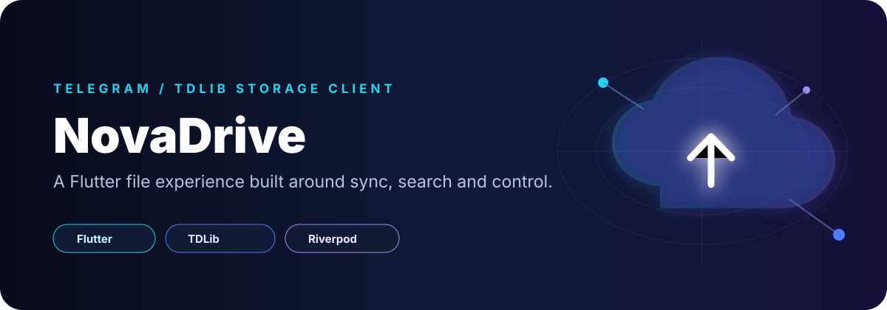
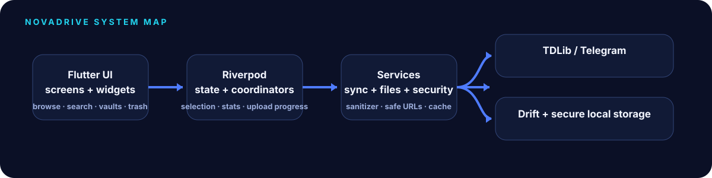

<p align="center"></p>

<p align="center"><strong>A drive-style file manager that uses Telegram/TDLib as the storage and sync layer, so users can browse, search and organize files without working through a chat-first interface.</strong></p>

<p align="center"><code>Flutter</code> · <code>Dart</code> · <code>Riverpod</code> · <code>GoRouter</code> · <code>Drift</code> · <code>TDLib</code> · <code>flutter_secure_storage</code></p>

<p align="center"></p>

## Why this is useful

Telegram can hold a lot of personal files, but finding and managing those files through chats is not the same experience as using a dedicated drive application. NovaDrive explores a different interface on top of that storage layer.

It is useful for:

- people who already keep files in Telegram and want a more familiar file-manager experience;
- browsing files by category instead of scrolling through chat history;
- searching, filtering, selecting, downloading and organizing Telegram-backed files;
- experimenting with a cross-platform personal drive interface without running a separate file-storage backend;
- learning how Flutter can coordinate local metadata, secure client values and TDLib synchronization;
- building a base for smart vaults, trash, storage statistics and richer file workflows.

The project does not turn ordinary Telegram cloud chats into universal end-to-end-encrypted storage. It presents Telegram-backed content through a different client experience.

<table>
<tr>
<td width="25%" valign="top"><br><strong>Telegram sync</strong><br>TDLib bridge, Telegram storage services and synchronization orchestration.</td>
<td width="25%" valign="top"><br><strong>Drive navigation</strong><br>Browsing, pagination, filtering, search, selection and file actions.</td>
<td width="25%" valign="top"><br><strong>Organization</strong><br>Categories, smart vaults, local metadata and trash workflows.</td>
<td width="25%" valign="top"><br><strong>Client hardening</strong><br>Secure local storage, content sanitization and safer external URL handling.</td>
</tr>
</table>

## Architecture

<p align="center"></p>

The implementation is split into clear layers:

- **Presentation:** feature screens and reusable `nova_*` widgets.
- **State:** Riverpod providers for bootstrap, search, filtering, selection, upload progress, thumbnails, storage statistics and trash.
- **Application services:** download, media cache, logging, secure storage, Telegram storage and synchronization services.
- **Telegram bridge:** TDLib FFI and bridge code.
- **Local persistence:** Drift/SQLite metadata plus platform secure storage for sensitive client-side values.
- **Security utilities:** content sanitization and safe URL launching with dedicated tests.

## Current feature surface

```text
Authentication
Drive browser
Categories
Search
Smart vaults
Upload progress
Storage statistics
Trash / restore flow
Settings
Developer diagnostics
Telegram synchronization
```

## Typical user flow

```text
Sign in to Telegram
       |
       v
Sync file metadata
       |
       v
Browse files like a drive
  |       |       |
  v       v       v
search  organize  download
  |                 |
  +------> trash / restore
```

## Build from source

Prerequisites: a Flutter toolchain compatible with the Dart SDK constraint in `pubspec.yaml`, plus platform-specific tooling for the target you build.

```bash
git clone https://github.com/cassielxyz/NovaDrive.git
cd NovaDrive
flutter pub get
flutter analyze
flutter test
flutter run
```

For an Android release build:

```bash
flutter build apk --release
```

## Authentication and local secrets

NovaDrive requires Telegram API credentials/session setup to communicate through TDLib. Keep API IDs, hashes, session material and other sensitive values out of Git history. The app includes `flutter_secure_storage` for sensitive local values, but platform storage guarantees differ; review each target before production distribution.

## Security notes

- Telegram cloud chats and Saved Messages should not be described as universal end-to-end encrypted storage.
- Treat file names, captions, links and remote metadata as untrusted input.
- Keep TDLib databases and session state out of source control and public backups.
- Validate downloaded files before opening them with external applications.
- Keep external URL launching constrained to expected schemes and destinations.
- Test logout/session-reset behavior so local metadata does not outlive intended account state.

## Project structure

```text
lib/
├─ core/
│  ├─ database/        Drift database and DAOs
│  ├─ providers/       app-wide Riverpod state
│  ├─ security/        sanitizer layer
│  ├─ services/        storage, sync, download, cache, logging
│  ├─ telegram_core/   TDLib bridge / FFI
│  ├─ theme/           visual tokens and themes
│  └─ utils/           safe URL and shared helpers
├─ features/
│  ├─ auth/
│  ├─ categories/
│  ├─ dashboard/
│  ├─ developer/
│  ├─ search/
│  ├─ settings/
│  ├─ smart_vaults/
│  └─ trash/
└─ shared/widgets/     NovaDrive component library
```

## Technology choices

| Layer | Choice |
| --- | --- |
| UI | Flutter / Material |
| State | Riverpod |
| Routing | GoRouter |
| Local database | Drift + SQLite |
| Telegram client | TDLib via `handy_tdlib` |
| Sensitive local values | `flutter_secure_storage` |
| File access | `file_picker`, `open_filex`, `path_provider` |
| Reactive utilities | RxDart |

## Topics and tags

`flutter` · `dart` · `cloud-storage` · `telegram` · `tdlib` · `file-manager` · `riverpod` · `drift` · `sqlite` · `cross-platform` · `secure-storage` · `sync` · `personal-cloud`

## Suggested GitHub About description

> Drive-style Flutter file manager for Telegram-backed storage, adding search, categories, smart vaults, trash and local metadata on top of a TDLib sync layer.

## License

NovaDrive is distributed under the MIT License. See `LICENSE` for the full terms.

<p align="center"></p>
<p align="center"><sub>A familiar drive experience for files that already live in Telegram.</sub></p>
